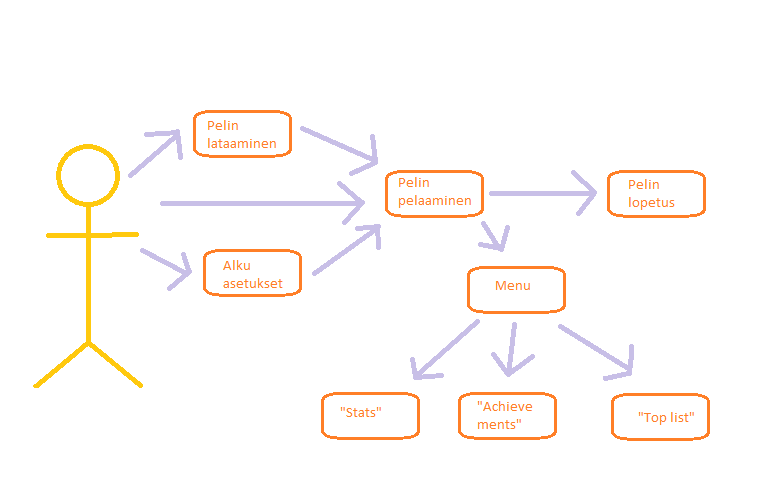

## Käyttötapaukset

* käyttötapaukset (use cases): listaa oleellsimmat ranskalaisin viivoin käyttäjäryhmäkohtaisesti tai piirrä käyttötapauskaavio
  - Hupi/sisätilapaikannus
  - pelatessa oppilaalle rakennus tulee tutuksi 
  
 
* Määritä tänne järjestelmän loppukäyttäjät
  * Loppukäyttäjiä ovat pääasiallisesti koulun oppilaat
  * Lisäksi kuitenkin pelata voi myös koululla vierailijat (kunhan lataa ensin appin)
  * Myös opettajat voivat käyttää peliä halutessaan

* Käyttötapauskaavio, jossa järjestelmän keskeiset käyttötapaukset
* Kuvaile tärkeimmät käyttötapauksista käyttötapausskenaarioina mallipohjaan perustuen
  * mallipohja: määritä alkutila (initial state), normaali kulku (normal flow), lopputila (end state)
  * kerro myös kuinka normaali kulku voi mennä pieleen sekä
  * mahdolliset vaihtoehtoiset kulut (alternate flow)

