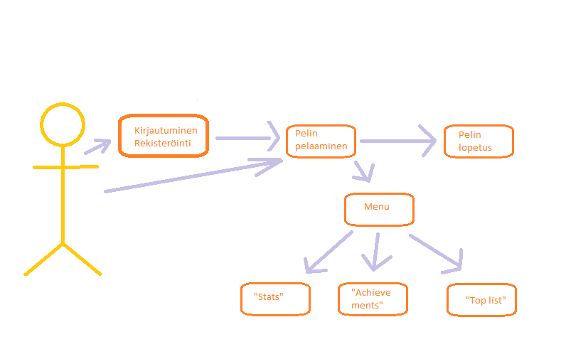

## Käyttötapaukset

### Käyttötapauskaavio
 
 
 
* Määritä tänne järjestelmän loppukäyttäjät
  * Loppukäyttäjiä ovat pääasiallisesti koulun oppilaat
  * Lisäksi kuitenkin pelata voi myös koululla vierailijat (kunhan lataa ensin appin)
  * Myös opettajat voivat käyttää peliä halutessaan

* Kuvaile tärkeimmät käyttötapauksista käyttötapausskenaarioina mallipohjaan perustuen
  * mallipohja: määritä alkutila (initial state), normaali kulku (normal flow), lopputila (end state)
    - Alkutila: 
              Rekisteröinti/Kirjautuminen 
    - Normaali kulku: 
    
    - Lopputila: 
    
  * kerro myös kuinka normaali kulku voi mennä pieleen sekä
  * mahdolliset vaihtoehtoiset kulut (alternate flow)

