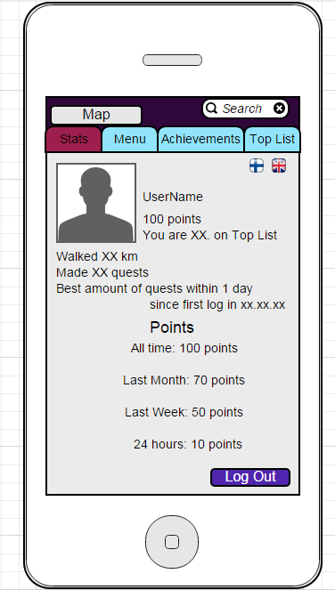

## Käyttöliittymä

# käyttöliittymäluonnoksia (mockups)

Alkunäyttö

*Näkymä kartasta (perusnäkymä), jossa valittuna luokka || Näkymä, kun tulee pop-up -ilmoitus kesken pelin (taustalla kartta)

* Näkymä Menusta
  

* Esimerkkinäkymä, mitä pelaajan omissa tiedoissa näkyy.

 

#---#

* listaa käyttöliittymän näkymät
   - Kirjautumisnäyttö
       - vaihtoehtoisesti kirjaudu/rekisteröidy
       - unohtunut salasana
   - loading screen, tulee kirjautumisen jälkeen, aivan pelin alussa
       - mainokset
   - kartta
      - ilmoitukset / pop upit
         - uudet daily questit; tietty merkki luokassa
         - tavoitteet suoritettu
         - spesiaalitehtävät 
              - pitää suorittaa tietyssä ajassa ennen kuin sulkeutuu
         - tiedot huoneista; mikä tunti, varaukset
      - oma paikka
          - reitti päivän aikana (klikatessa)
      - search
      - menu-nappi

  - menu
    - omat tiedot 
      - tehtävät
            - esim. käy jossain luokassa ja tule takaisin viiden minuutin sisään
            - osaan tehtävistä tarvitsee parin / ryhmän
    - achievement (tavoitteet)
            - esim. kuinka paljon on tullut käveltyä; tietystä määrästä tiettyjä pisteitä
            - daily questien suorittaminen 
    - top list
            - kuka saanut eniten pisteitä 
              - eniten kävelty
              - eniten pisteitä

 
* niiden keskinäiset suhteet

* kuvaile mitä näkymässä tapahtuu / tehdään

