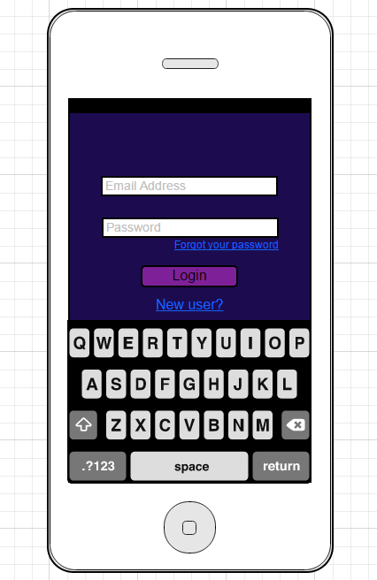
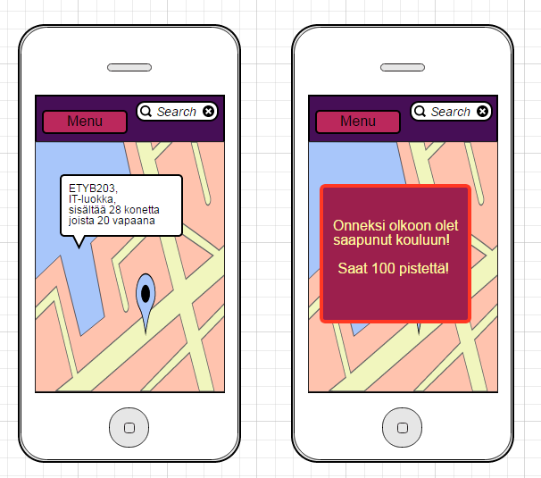
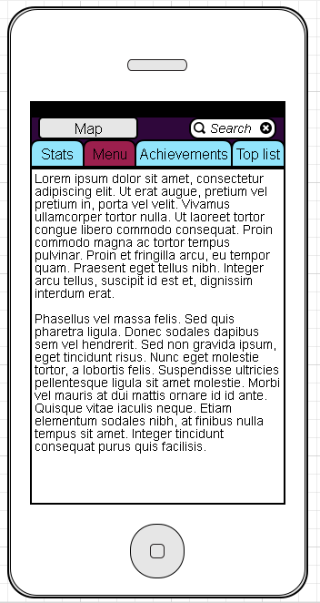
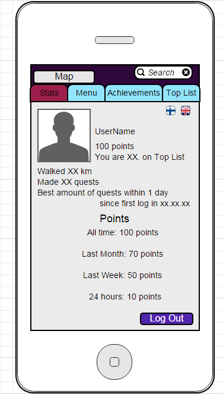

## Käyttöliittymä

# käyttöliittymäluonnoksia (mockups)

Alkunäyttö

*Näkymä kartasta (perusnäkymä), jossa valittuna luokka || Näkymä, kun tulee pop-up -ilmoitus kesken pelin (taustalla kartta)

* Näkymä Menusta
  

* Esimerkkinäkymä, mitä pelaajan omissa tiedoissa näkyy.

 

#---#

* listaa käyttöliittymän näkymät
   - Kirjautumisnäyttö
       - vaihtoehtoisesti kirjaudu/rekisteröidy
       - unohtunut salasana
   - loading screen, tulee kirjautumisen jälkeen, aivan pelin alussa
       - mainokset
   - kartta
      - ilmoitukset / pop upit
         - uudet daily questit; tietty merkki luokassa
         - tavoitteet suoritettu
         - spesiaalitehtävät 
              - pitää suorittaa tietyssä ajassa ennen kuin sulkeutuu
         - tiedot huoneista; mikä tunti, varaukset
      - oma paikka
          - reitti päivän aikana (klikatessa)
      - search
      - menu-nappi

  - menu
    - omat tiedot 
      - tehtävät
            - esim. käy jossain luokassa ja tule takaisin viiden minuutin sisään
            - osaan tehtävistä tarvitsee parin / ryhmän
    - achievement (tavoitteet)
            - esim. kuinka paljon on tullut käveltyä; tietystä määrästä tiettyjä pisteitä
            - daily questien suorittaminen 
    - top list
            - kuka saanut eniten pisteitä 
              - eniten kävelty
              - eniten pisteitä

 
* niiden keskinäiset suhteet

* kuvaile mitä näkymässä tapahtuu / tehdään

####3. Kuvaile näkymät sanallisesti: mitä näkymällä tehdään ja mitä siinä näkyy. Pyri määrittelemään tässä näkymät toiminnallisesta näkökulmasta, älä niinkään ajattele miltä ne näyttävät.

 ####

 ####Loading screen tulee näkyviin vain alussa ja sisältää mainoksia; mahdollisuus painaa mainosta josta pääsee mainoksen         sivuille.

####Karttanäkymässä näkyy oma liikkuminen, voi käyttää myös suunnistamiseen koulussa. 
  -Daily questit näkyvät omalla merkillään tiloissa joissa niitä on. 
   -Menulla on oma nappulansa ja search palkki löytyy yläpalkista. 
    -Search palkilla voi etsiä luokan paikan.
    -Ilmoitukset tulevat karttanäkymän päälle (pop up), josta ne voi halutessaan poistaa. 
    -Klikkaamalla luokkaa karttanäkymässä saa tiedot luokan toiminnoista; tulee esille ilmoitusten tavoin.
    
Menussa on yläreunassa valikko, josta lyötyy omat tiedot, tehtävät, achievementit ja top list. 
   Painamalla esimerkiksi omia tietoja alapuolelle aukeaa sisältö. (kts Kuva 5)
   Menu näkymässä on myös yläkulmassa search palkki, sekä Map-nappi josta pääsee takaisin kartalle.

 
###4. Määritä näkymien väliset siirtymät korkealla tasolla, mistä näkymästä pääsee minnekin? Millä tavoin visualisoisit tilasiirtymät?

Kuvailu kolmannessa kohdassa.
 
####5. Listaa jokaista näkymää kohti tieto siitä, millaista tietosisältöä tai data käyttöliittymässä näytetään.
Omat tiedot sisältää oman käyttäjänimen, pisteet kokonaisuudessaan, kuukaudessa, viikossa ja paivän aikana. Tiedoissa 	lukee myös kuinka paljon on kävellyt. Top listissa näkyy sata parasta pistemäärien mukaan, eniten kävelleiden kesken ja 		parhaat tänään kummistakin osoista

