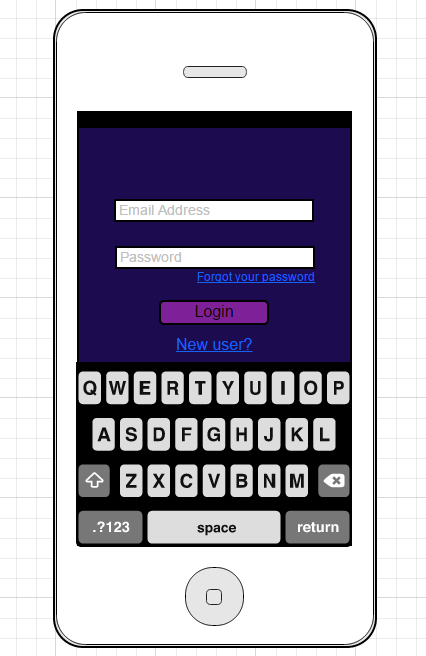
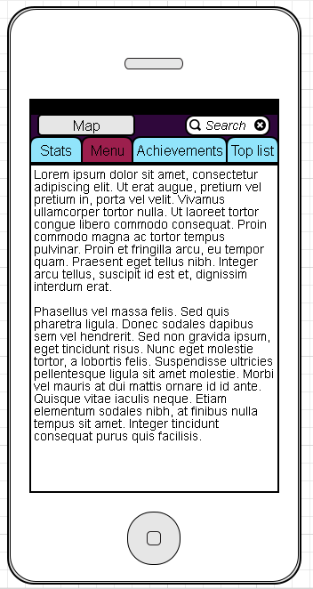
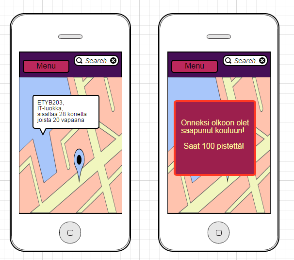

## Käyttöliittymä

* käyttöliittymäluonnos (mockup)
* 

Alkunäyttö

  

 Näkymä Menusta

Näkymä kartasta (perusnäkymä), jossa valittuna luokka || Näkymä, kun tulee pop-up -ilmoitus kesken pelin (taustalla kartta)
  
  

* listaa käyttöliittymän näkymät
   - kartta
    - ilmoitukset / pop upit
        - uudet daily questit; tietty merkki luokassa
        - tavoitteet suoritettu
        - spesiaalitehtävät 
            - pitää suorittaa tietyssä ajassa ennen kuin sulkeutuu
        - tiedot huoneista; mikä tunti, varaukset
    - oma paikka
        - reitti päivän aikana (klikatessa)
    - search

  - menu
    - omat tiedot 
    - tehtävät
        - daily quest 
            - esim. käy jossain luokassa ja tule takaisin viiden minuutin sisään
            - osaan tehtävistä tarvitsee parin / ryhmän
        - achievement (tavoitteet)
            - kuinka paljon on tullut käveltyä; tietystä määrästä tiettyjä pisteitä
            - daily questien suorittaminen
        - top list
            - kuka saanut eniten pisteitä 
                - kävely
                - daily quest
    - loading screen, tulee kirjautumisen jälkeen, aivan pelin alussa
       - mainokset
 
* niiden keskinäiset suhteet

* kuvaile mitä näkymässä tapahtuu / tehdään

